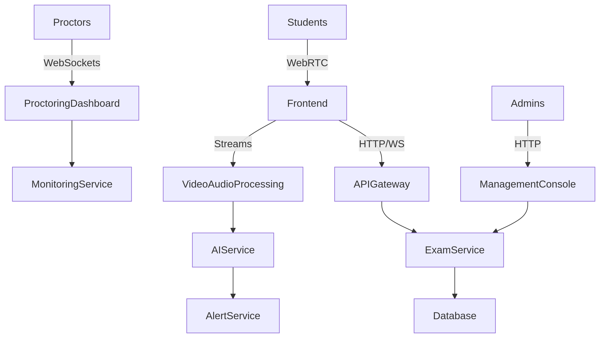

# EduProctor - Online Exam Proctoring System

 

## 🚀 Key Features
- **AI-Powered Proctoring**  
  Real-time face detection, eye tracking, and audio analysis
- **Military-Grade Security**  
  End-to-end encryption for all exam data
- **Scalable Infrastructure**  
  Supports 1000+ concurrent exams with <2s latency
- **LMS Integration**  
  Seamless connection with Moodle, Canvas, and Blackboard

## 📦 Quick Start
```bash
# Clone repository
git clone https://github.com/yenat/EduProctor.git

# Setup (see full guide in docs/setup-guide.md)
cd EduProctor
docker-compose up -d